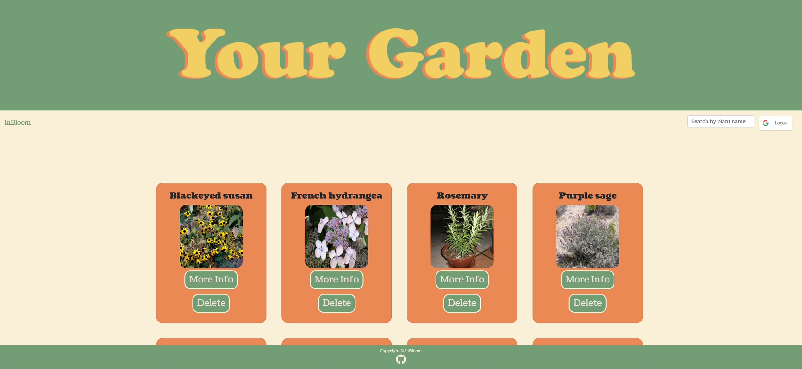
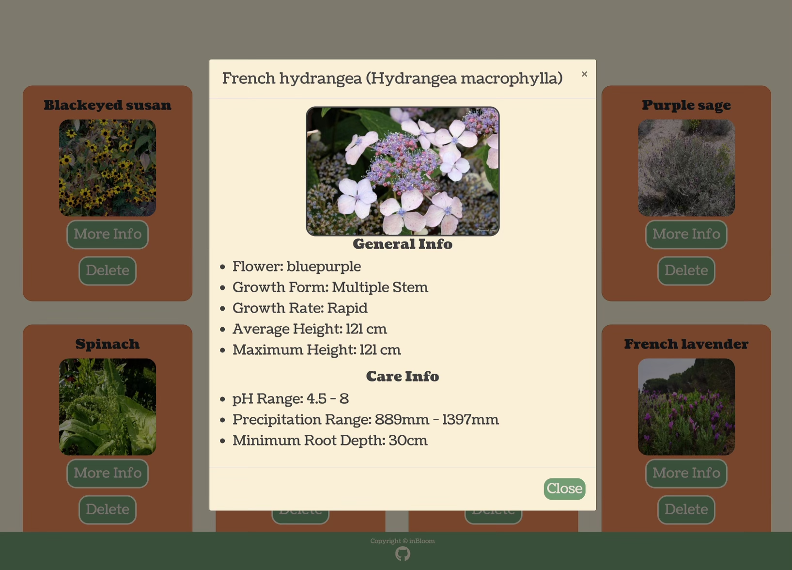

** :mushroom: [Check it out!](https://in-bloom.herokuapp.com)


## 🌿 Usage Instructions:
### Getting Started
From our home page, log in with your Google account. You will then be taken to the garden page. 

### Growing your Garden
To add plants to your garden, start typing the name of the desired plant in the search bar on the right side of the screen. Search results will populate, add plants directly from those results with the `plant it!` button, or find out more information on each plant with the `more info` button. You can also add the plant from within the modal that populates when the `more info` button is selected. From here, you can add more plants by repeating this process, or you can navigate back to your garden by selecting the `back to garden` button on the top left of the navigation bar. Now you will be able to see all the plants you have added to your garden!

### Deleting Plants
To delete a plant, select the `delete plant` button on the plant you'd like to delete. The page will automatically re-render with your updated garden.

### Logging Out
To logout from your inBloom profile, click the Google Logout button on the top right side of the navbar.

## :mushroom: Installation Instructions:
### Prerequisite
**You will need to have MySQL installed on your machine to use this locally**
````
https://dev.mysql.com/doc/mysql-installation-excerpt/5.7/en/installing.html
````
Once you've ensured that MySQL is installed, you will need to clone the repository to your local machine

````
git clone https://github.com/ashlinhanson/inBloom.git
````

Then you will need to install the dependencies needed to run the application
````
npm install
````
and add your password to config.json.
````
"username": "root",
"password": "",
````
Then open your MySQL WorkBench (or chosen SQL tool) and run the command
```
CREATE DATABASE in_bloom;
```
and finally run in the command line
````
npm start
````
and it open the browser to run the application

## :mushroom: Site Features:
🌿 Landing Page 🌿 

🌿 Garden Page 🌿

🌿 Plant Data 🌿


## 🌿 Technologies Used:
<a href="https://reactjs.org/" title="React"> React</a>
<a href="https://dev.mysql.com/" title="MySQL"> MySQL</a>
<a href="https://expressjs.com/" title="Express"> Express</a>
<a href="https://nodejs.org/" title="Node.js"> Node.js</a>
<a href="https://getbootstrap.com/" title="Bootstrap"> Bootstrap</a>
<a href="https://www.adobe.com/products/illustrator.html" title="Adobe Illustrator"> Adobe Illustrator</a>
* GSAP
* Trefle API

## 🌿 Future Development:
* Find a better API with complete data and care info
* Create a water reminder button for each plant to notify when it needs to be watered
* Link local nurseries for plants and plant care resources/items
* Create a secondary route for users without a gmail account
* Search for plants by photo

## :mushroom: Collaborators:
* Ashli Hanson 🌿 [GitHub](https://github.com/ashlinhanson)
* Lili Clift 🌿 [GitHub](https://github.com/LiliCecilia23)
* Josh Wilson 🌿 [GitHub](https://github.com/josh-wilson6289)
* Nay Wilkins 🌿 [GitHub](https://github.com/naywilkins512)

## 🌿 License:
Copyright (c) 2020 Ashli Hanson Licensed under the MIT license.


